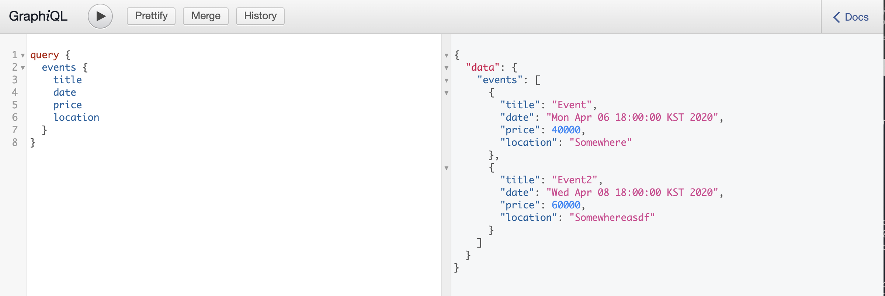

# Backend for DevEvents website (with Spring🌺 framework)

## 👪 기여자

이 프로젝트를 더 좋은 방향으로 만들고 싶다면 이슈나 PR을 열어주시기 바랍니다!

- [🔗Unperknown](https://github.com/Unperknown)

## 🔑 기술 스택

## 📄 API 문서

[🔗]()

## 개발 진척

### 4/10 - 개발 환경 설정

Kotlin + Spring Boilerplate를 레포지토리에 추가하였다.

### 4/11 - GraphQL 적용

Spring Boot에 GraphQL를 적용했다.

